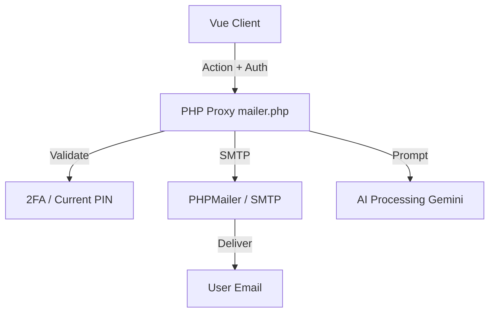
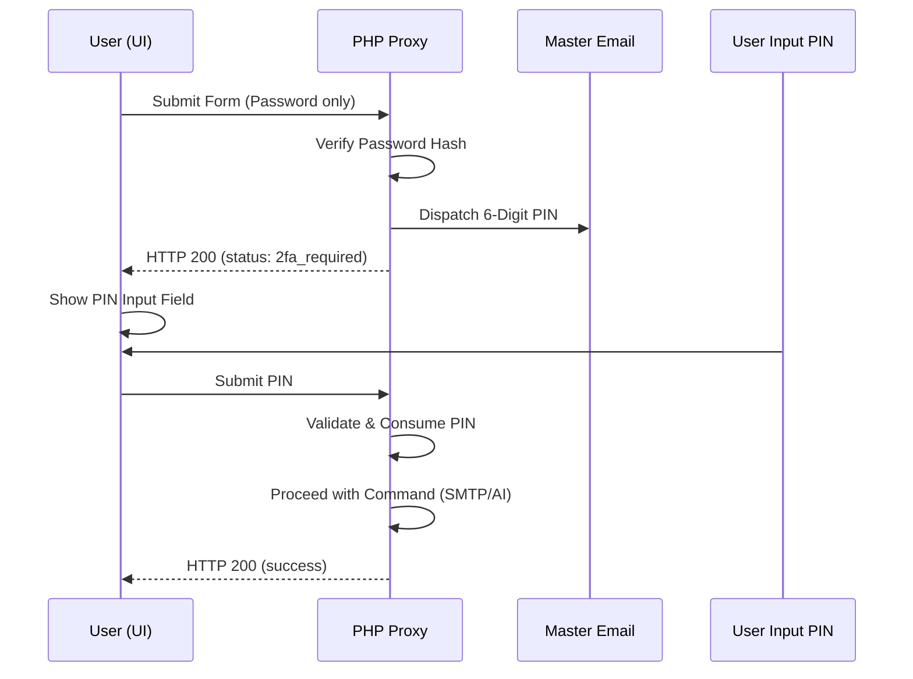

# System Architecture: HUD v4 & Secure Proxy

## 🎨 UI Design System (HUD v4)

The interface follows a "Tactical Information Display" (HUD) aesthetic.

- **Design Tokens**: Centralized in `src/style.css` using CSS Variables (`--accent`, `--glass-bg`).
- **Animations**: Accelerated keyframes for `pulse`, `slideIn`, and `spin` effects.
- **Layout Aware Scaling**: Uses `zoom` for the preview pane to ensure the 1000px email template scales organically to fit any viewport size without internal scrollbars.

## 🛸 Logical Architecture

### 1. The Composable Pattern

State logic is decoupled from the UI using the `useEmailForm` composable. This allows the `EmailForm.vue` component to remain purely presentational, while the composable handles:

- Form state and validation.
- 2FA state transitions.
- API submission flow.

### 2. The Proxy Architecture

To avoid CORS issues and protect sensitive API keys, the application uses a PHP Proxy (`mailer.php`):

- **Client**: Sends a request to `/mailer.php` with an action and encrypted credentials.
- **Proxy**: Validates 2FA and password server-side, then executes the requested action (AI Polish or SMTP Send).

## 📊 Operational Sequences

### 2FA Authorization Flow

## 📊 Data Flow

1.  **Input**: User enters signal data.
2.  **Auth**: User provides master key; system triggers 2FA if PIN is missing.
3.  **Proxy**: Backend validates PIN and interacts with Gemini/SMTP.
4.  **Feedback**: HUD updates status to `TRANSMISSION COMPLETE`.
